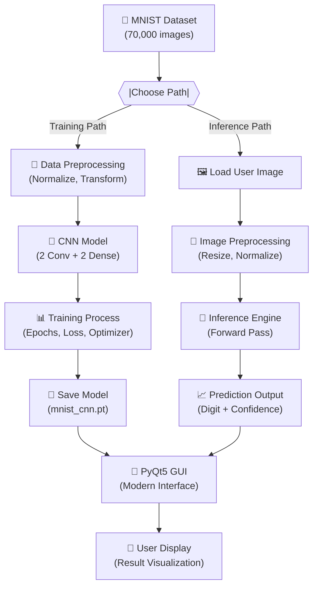

# 🧠 MNIST Digit Recognition

A complete implementation of a **Convolutional Neural Network (CNN)** for handwritten digit recognition using the MNIST dataset. This project includes both a training script and a modern PyQt5 GUI for real-time digit prediction.


---

## 🎯 Features

- 🎨 **Modern GUI** - User-friendly PyQt5 interface for real-time predictions
- 🚀 **Optimized CNN Architecture** - 2 Convolutional layers + 2 Fully Connected layers
- 📊 **High Accuracy** - ~99% accuracy on MNIST test dataset
- ⚡ **GPU Support** - CUDA acceleration for faster training
- 💾 **Model Persistence** - Pre-trained model included, easy to save/load
- 🔍 **Image Upload** - Upload and predict digits from custom images
- 📈 **Confidence Scores** - Get prediction probabilities for all classes

---

## 📋 Table of Contents

- [Quick Start](#-quick-start)
- [Installation & Setup](#-installation--setup)
- [Usage](#-usage)
- [Project Structure](#-project-structure)
- [System Architecture](#-system-architecture)
- [Model Architecture](#-model-architecture)
- [Data Flow](#-data-flow)
- [Dataset](#-dataset)
- [Results](#-results)
- [Documentation](#-documentation)
- [Technologies](#-technologies)
- [Author](#-author)
- [Contributing](#-contributing)

---

## 🚀 Quick Start

### Run the GUI Application (Recommended)

```bash
python modern_gui.py
```

The GUI allows you to:

- Upload images of handwritten digits
- Get instant predictions with confidence scores
- View results in a modern, intuitive interface

### Train the Model

```bash
python main.py --save-model
```

Optional arguments:

```bash
python main.py --save-model \
  --batch-size 64 \
  --epochs 10 \
  --lr 1.0
```

---

## 📦 Installation & Setup

### Prerequisites

- **Python 3.8+** - [Download](https://www.python.org/downloads/)
- **Git** - [Download](https://git-scm.com/)
- **pip** - Usually comes with Python
- **(Optional) CUDA 11.8+** - For GPU acceleration with NVIDIA GPUs

### Step-by-Step Setup

#### 1. Clone the Repository

```bash
# Clone using HTTPS (recommended for most users)
git clone https://github.com/VishnuKant0925/MNIST-Digit-Classifier-.git
cd MNIST-Digit-Classifier-

# OR clone using SSH (if you have SSH keys configured)
git clone git@github.com:VishnuKant0925/MNIST-Digit-Classifier-.git
cd MNIST-Digit-Classifier-
```

#### 2. Create a Virtual Environment

**On macOS/Linux:**

```bash
python3 -m venv venv
source venv/bin/activate
```

**On Windows (PowerShell):**

```powershell
python -m venv venv
.\venv\Scripts\Activate.ps1
```

**On Windows (Command Prompt):**

```bash
python -m venv venv
venv\Scripts\activate.bat
```

#### 3. Verify Virtual Environment

```bash
python --version  # Should show Python 3.8 or higher
pip --version    # Should show pip version
```

#### 4. Install Dependencies

```bash
# Upgrade pip first (recommended)
pip install --upgrade pip

# Install project dependencies
pip install -r requirements.txt
```

**With GPU Support (CUDA):**

```bash
# For NVIDIA GPU acceleration (requires CUDA toolkit)
pip install torch torchvision --index-url https://download.pytorch.org/whl/cu118
pip install PyQt5
```

#### 5. Verify Installation

```bash
python -c "import torch; print(f'PyTorch version: {torch.__version__}')"
python -c "import torchvision; print(f'TorchVision version: {torchvision.__version__}')"
python -c "from PyQt5.QtWidgets import QApplication; print('PyQt5 installed successfully')"
```

---

## 💻 Usage

### GUI Application

```bash
python modern_gui.py
```

**Features:**

- Drag and drop image upload
- Real-time digit recognition
- Confidence percentage display
- Clean, intuitive interface

### Command Line Training

**Full Training (60,000 samples):**

```bash
python main.py --save-model --epochs 10
```

**Quick Test Run:**

```bash
python main.py --dry-run
```

**Custom Hyperparameters:**

```bash
python main.py \
  --batch-size 128 \
  --epochs 15 \
  --lr 0.5 \
  --save-model \
  --log-interval 100
```

---

## 📁 Project Structure

```
.
├── main.py                 # Training script and CNN model definition
├── modern_gui.py           # PyQt5 GUI application for predictions
├── mnist_cnn.pt            # Pre-trained model weights (~1.3 MB)
├── requirements.txt        # Python dependencies (torch, torchvision, PyQt5)
├── README.md               # This file
├── report.tex              # Detailed technical report
├── .gitignore              # Git ignore rules
└── system_flowchart.png    # System architecture diagram
```

### File Descriptions

| File               | Purpose                                                          | Size    |
| ------------------ | ---------------------------------------------------------------- | ------- |
| `main.py`          | Training script, model architecture, hyperparameters             | ~2 KB   |
| `modern_gui.py`    | PyQt5 GUI application, image prediction interface                | ~4 KB   |
| `mnist_cnn.pt`     | Pre-trained model weights (can be retrained)                     | ~1.3 MB |
| `requirements.txt` | Python package dependencies                                      | <1 KB   |
| `report.tex`       | Comprehensive technical report (architecture, results, analysis) | ~20 KB  |
| `.gitignore`       | Git ignore rules for version control                             | <1 KB   |

---

## 🏗️ System Architecture

### High-Level System Design



### Component Interaction


---

## 🧠 Model Architecture

The CNN consists of:

```
Input (1, 28, 28)
    ↓
Conv2d(1 → 32 filters, 3×3) + ReLU → (32, 26, 26)
    ↓
Conv2d(32 → 64 filters, 3×3) + ReLU → (64, 24, 24)
    ↓
MaxPool(2×2) → (64, 12, 12)
Dropout(0.25)
    ↓
Flatten → 9216
    ↓
Dense(9216 → 128) + ReLU → (128)
Dropout(0.5)
    ↓
Dense(128 → 10) + LogSoftmax → (10)
```

### Mermaid Architecture Diagram

```mermaid
graph TD
    A["Input Image<br/>(1, 28, 28)"] --> B["Conv2d Layer 1<br/>1→32 filters, 3×3<br/>Output: 32, 26, 26"]
    B --> C["ReLU Activation<br/>(Non-linearity)"]
    C --> D["Conv2d Layer 2<br/>32→64 filters, 3×3<br/>Output: 64, 24, 24"]
    D --> E["ReLU Activation"]
    E --> F["MaxPool 2×2<br/>Output: 64, 12, 12"]
    F --> G["Dropout 0.25<br/>(Regularization)"]
    G --> H["Flatten<br/>→ 9216 neurons"]
    H --> I["Dense Layer 1<br/>9216 → 128<br/>ReLU Activation"]
    I --> J["Dropout 0.5"]
    J --> K["Dense Layer 2<br/>128 → 10<br/>LogSoftmax"]
    K --> L["Output<br/>Digit Prediction<br/>0-9"]

    style A fill:#E8F5E9,stroke:#2E7D32,stroke-width:2px,color:#000
    style B fill:#2E7D32,stroke:#1B5E20,stroke-width:2px,color:#fff
    style C fill:#558B2F,stroke:#33691E,stroke-width:2px,color:#fff
    style D fill:#2E7D32,stroke:#1B5E20,stroke-width:2px,color:#fff
    style E fill:#558B2F,stroke:#33691E,stroke-width:2px,color:#fff
    style F fill:#1565C0,stroke:#0D47A1,stroke-width:2px,color:#fff
    style G fill:#4527A0,stroke:#311B92,stroke-width:2px,color:#fff
    style H fill:#0277BD,stroke:#01579B,stroke-width:2px,color:#fff
    style I fill:#1565C0,stroke:#0D47A1,stroke-width:2px,color:#fff
    style J fill:#4527A0,stroke:#311B92,stroke-width:2px,color:#fff
    style K fill:#F57F17,stroke:#E65100,stroke-width:2px,color:#fff
    style L fill:#00695C,stroke:#004D40,stroke-width:2px,color:#fff
```



**Key Components:**

- **Conv Layers**: Extract spatial features from images
- **ReLU Activation**: Non-linearity for learning complex patterns
- **Max Pooling**: Reduce dimensionality while preserving important features
- **Dropout**: Regularization to prevent overfitting
- **Dense Layers**: Classification head with 10 output classes

---

## � Data Flow

### Training Data Pipeline


### Inference Data Pipeline


---

## �📊 Dataset

**MNIST Dataset Overview:**

| Attribute        | Value               |
| ---------------- | ------------------- |
| **Total Images** | 70,000              |
| **Training Set** | 60,000              |
| **Test Set**     | 10,000              |
| **Image Size**   | 28 × 28 pixels      |
| **Channels**     | 1 (Grayscale)       |
| **Classes**      | 10 (0-9)            |
| **Source**       | PyTorch TorchVision |

**Preprocessing:**

```python
transforms.Compose([
    transforms.ToTensor(),           # Convert to tensor [0, 1]
    transforms.Normalize(            # Normalize with MNIST statistics
        (0.1307,),                   # Mean
        (0.3081,)                    # Std Dev
    )
])
```

---

## 🎯 Results

| Metric             | Value               |
| ------------------ | ------------------- |
| **Test Accuracy**  | ~99%                |
| **Training Loss**  | < 0.01              |
| **Model Size**     | ~1.3 MB             |
| **Inference Time** | < 10 ms (per image) |

---

## � Documentation

### Technical Report

The project includes a comprehensive **technical report** (`report.tex`) that covers:

- **Project Overview** - Objectives, scope, and motivation
- **Literature Review** - CNN fundamentals, MNIST dataset overview, related work
- **Methodology** - Data preprocessing, model architecture design, training strategy
- **Implementation Details** - Code structure, hyperparameter selection, optimization techniques
- **Experimental Results** - Performance metrics, accuracy analysis, loss curves, confusion matrices
- **Performance Analysis** - Inference speed benchmarks, GPU vs CPU comparison, model optimization
- **Conclusions & Future Work** - Key findings, limitations, and potential improvements

**How to View the Report:**

```bash
# Compile LaTeX to PDF (requires pdflatex or similar)
pdflatex report.tex

# Or open report.pdf directly if pre-compiled
```

### Key Sections in Report

1. **CNN Architecture Analysis** - Detailed explanation of layer configurations and design choices
2. **Training Metrics** - Learning curves, loss progression, convergence analysis
3. **Model Evaluation** - Accuracy on different test subsets, class-wise performance
4. **Performance Optimization** - GPU acceleration benefits, inference optimization techniques
5. **Deployment Considerations** - Model size, latency requirements, real-world applications

---

## �🛠️ Technologies

- **PyTorch** - Deep learning framework
- **TorchVision** - Computer vision utilities
- **PyQt5** - GUI framework
- **Python 3.8+** - Programming language
- **CUDA** - GPU acceleration (optional)

---

## 📝 Requirements

See `requirements.txt`:

```
torch
torchvision
PyQt5
```

---

---

## 👨‍💻 Author

**Vishnu Kant**

- Machine Learning enthusiast
- Deep Learning & Computer Vision specialist
- GitHub: [@VishnuKant0925](https://github.com/VishnuKant0925)
- Email: vishnukant844121@gmail.com

This project was developed as a comprehensive demonstration of CNN architecture, PyTorch implementation, and building production-ready ML applications with user interfaces.

---

## 🤝 Contributing

Contributions are welcome! Feel free to:

1. Fork the repository
2. Create a feature branch (`git checkout -b feature/amazing-feature`)
3. Commit your changes (`git commit -m 'Add amazing feature'`)
4. Push to the branch (`git push origin feature/amazing-feature`)
5. Open a Pull Request

### Ideas for Contributions

- Add support for other digit datasets
- Implement digit drawing canvas in GUI
- Add batch prediction capability
- Improve model architecture
- Add unit tests
- Optimize inference speed

---

## 📄 License

This project is licensed under the MIT License - see the LICENSE file for details.

---

## 🙏 Acknowledgments

- MNIST dataset provided by [Yann LeCun](http://yann.lecun.com/exdb/mnist/)
- Built with [PyTorch](https://pytorch.org/)
- GUI framework by [PyQt5](https://www.riverbankcomputing.com/software/pyqt/)

---

## 📞 Support

For issues, questions, or suggestions:

- 📝 Open an [issue](https://github.com/VishnuKant0925/MNIST-Digit-Classifier-/issues) on GitHub
- 💬 Start a [discussion](https://github.com/VishnuKant0925/MNIST-Digit-Classifier-/discussions)
- 📧 Email: vishnukant844121@gmail.com

---

## 📚 Resources

- [PyTorch Documentation](https://pytorch.org/docs/)
- [MNIST Dataset Paper](http://yann.lecun.com/exdb/mnist/)
- [PyQt5 Documentation](https://www.riverbankcomputing.com/static/Docs/PyQt5/)
- [CNN Explained](https://en.wikipedia.org/wiki/Convolutional_neural_network)
- [Deep Learning Fundamentals](https://www.deeplearningbook.org/)

---

**Happy Recognizing! 🎉**

_Last updated: April 2026_
